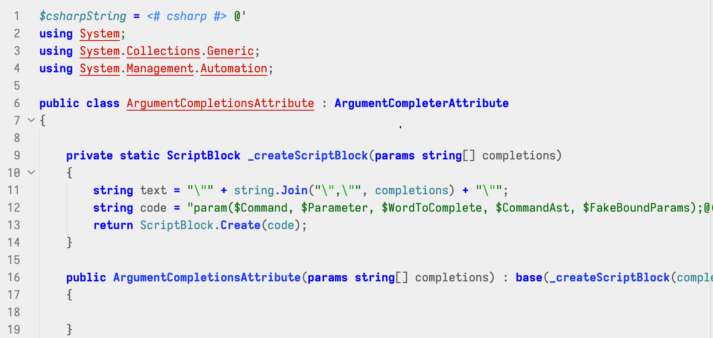
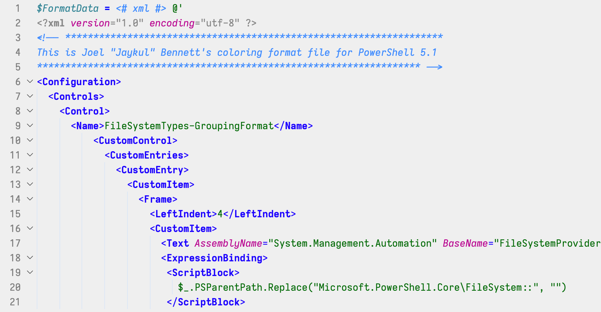

<!-- @TODO: Disabled until reconfigured 
[](https://marketplace.visualstudio.com/items?itemName=bierner.comment-tagged-templates)
[](https://travis-ci.org/mjbvz/vscode-comment-tagged-templates) 
-->

Adds basic syntax highlighting for PowerShell Here-Strings using language identifier comments:



 

Implemented using [vscode-comment-tagged-templates extension](https://github.com/mjbvz/vscode-comment-tagged-templates).

## Usage
The language identifier comment must appear before the opening backtick for the template string. Here is basic list of valid identifiers (note that some languages require that you install an VS Code extension that provides a grammar for that language):

<!--BEGIN_LANG_TABLE-->
| Language      | Supported Identifiers|
| ------------- | ---------------------|
| css | css, css.erb |
| ini | ini, conf |
| toml | toml |
| lua | lua |
| vs_net | vb |
| xml | xml, xsd, tld, jsp, pt, cpt, dtml, rss, opml |
| xsl | xsl, xslt |
| yaml | yaml, yml |
| c | c, h |
| cpp | cpp, c++, cxx |
| csharp | cs, csharp, c# |
| dockerfile | dockerfile, Dockerfile |
| git_commit | COMMIT_EDITMSG, MERGE_MSG |
| git_rebase | git-rebase-todo |
| go | go, golang |
| js | js, jsx, javascript, es6, mjs |
| js_regexp | regexp, regex, rgx, js_regex |
| json | json |
| jsonc | jsonc, json-comments, json comments, sublime-settings, sublime-menu, sublime-keymap, sublime-mousemap, sublime-theme, sublime-build, sublime-project, sublime-completions |
| md | md, markdown |
| powershell | powershell, ps1, psm1, psd1 |
| shell | shell, sh, bash, zsh, bashrc, bash_profile, bash_login, profile, bash_logout, .textmate_init |
| ts | typescript, ts |
| tsx | tsx |
| fsharp | fs, fsharp, f# |
| basic | html, htm, shtml, xhtml, inc, tmpl, tpl |
| java | java, bsh |
| makefile | Makefile, makefile, GNUmakefile, OCamlMakefile |
| perl | perl, pl, pm, pod, t, PL, psgi, vcl |
| ruby | ruby, rb, rbx, rjs, Rakefile, rake, cgi, fcgi, gemspec, irbrc, Capfile, ru, prawn, Cheffile, Gemfile, Guardfile, Hobofile, Vagrantfile, Appraisals, Rantfile, Berksfile, Berksfile.lock, Thorfile, Puppetfile |
| batch | bat, batch, batchfile, cmd |
| cfg | cfg, conf, config |
| perl6 | perl6, p6, pl6, pm6, nqp |
| python | python, py, py3, rpy, pyw, cpy, SConstruct, Sconstruct, sconstruct, SConscript, gyp, gypi |
| regexp_python | re |
| rust | rust, rs |
<!--END_LANG_TABLE-->

# Contributing

To build this extension, you'll need [Git](https://git-scm.com/downloads) and [Node.js](https://nodejs.org/).

First, [fork](https://help.github.com/articles/fork-a-repo/) this repo and clone your fork:

```bash
git clone https://github.com/YOUR_GITHUB_ACCOUNT_NAME/vscode-powershell-comment-tagged-here-strings.git
code vscode-powershell-comment-tagged-here-strings
```

Then install dev dependencies using npm:

```bash
npm install
```

The main grammar is generated using the script in `build/build.js`. To run it:

```bash
npm run build
```

The supported languages are defined in `build/languages.js`

To run the tests:

```bash
npm run test
```

